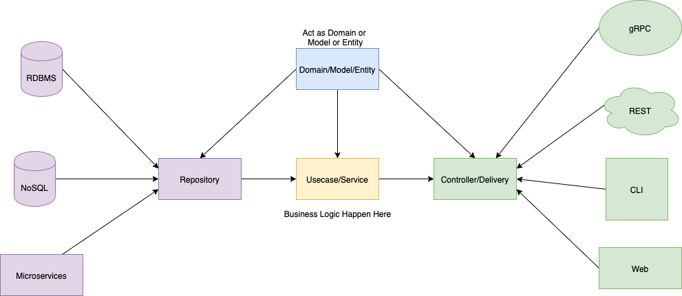

# gpt(golang-project-template)
- go 版本 > 1.16
> 本项目是通过CIL命令，一键创建一个 golang web 项目的结构。

## go get 安装
```bash
    go get -u github.com/luenci/gpt
```
### 验证版本
```shell
    gpt version
```

## 使用方法

### 查看版本
```bash
    gpt version
```

### 创建项目

#### gin web 项目结构(默认结构)
```bash
    gpt create -p gin test
```

#### DDD 项目结构
```bash
    gpt create -p DDD tests
```

#### 源码安装
##### 下载仓库
```bash
    git clone https://github.com/luenci/gpt.git
```
##### 进入项目
```shell
➜ cd gpt

➜ go build -o gpt main.go

➜ ./gpt version
  💻 gpt version is 0.0.1

➜ > ./gpt create -p gin tests
? What is project name ? luenci
🚀 Creating project luenci, please wait a moment.

CREATED luenci (608 bytes)
CREATED luenci/.gitignore (5475 bytes)
CREATED luenci/.golangci.yml (1812 bytes)
CREATED luenci/.pre-commit-config.yaml (520 bytes)
CREATED luenci/CHANGELOG.md (0 bytes)
CREATED luenci/Dockerfile (452 bytes)
CREATED luenci/Makefile (366 bytes)
CREATED luenci/README.md (645 bytes)
CREATED luenci/cmd (64 bytes)
CREATED luenci/config (64 bytes)
CREATED luenci/docs (64 bytes)
CREATED luenci/go.sum (0 bytes)
CREATED luenci/internal (224 bytes)
CREATED luenci/internal/app (64 bytes)
CREATED luenci/internal/controller (128 bytes)
CREATED luenci/internal/controller/http (96 bytes)
CREATED luenci/internal/controller/http/v1 (64 bytes)
CREATED luenci/internal/controller/rpc (64 bytes)
CREATED luenci/internal/entity (64 bytes)
CREATED luenci/internal/infra (64 bytes)
CREATED luenci/internal/usecase (64 bytes)
CREATED luenci/main.go (253 bytes)
CREATED luenci/pkg (64 bytes)
CREATED luenci/runtime (64 bytes)
CREATED luenci/schema (64 bytes)
CREATED luenci/tests (64 bytes)

🍺 Project creation succeeded luenci
💻 Use the following command to start the project 👇:

$ cd luenci
                        🤝 Thanks for using gpt (golang-project-template)
        📚 Tutorial: https://github.com/luenci/gpt#readme
```

### 说明
- 默认的项目结构，参考自 [go-backend-clean-architecture](https://github.com/amitshekhariitbhu/go-backend-clean-architecture)做了一些修改



- 我个人比较喜欢统一的代码风格和结构,所以将 `pre-commit` 这个配置文件设置为默认项。关于 `pre-commit` 的详细介绍，请参考：[pre-commit](https://pre-commit.com)

### TODO List
 - [x] 发布一个版本
 - [x] 增加更多的项目结构选择
   - [x] gin 项目
   - [x] DDD 项目
 - [ ] 补充单元测试
 - [ ] 增加更多的参数配置化

### 鸣谢
  > 感谢以下项目的给我的启发
  - [kratos](https://github.com/go-kratos/kratos)
  - [go-micro](https://github.com/asim/go-micro)

### 后记
  > 如果你有什么想法，欢迎在issue中提出。
